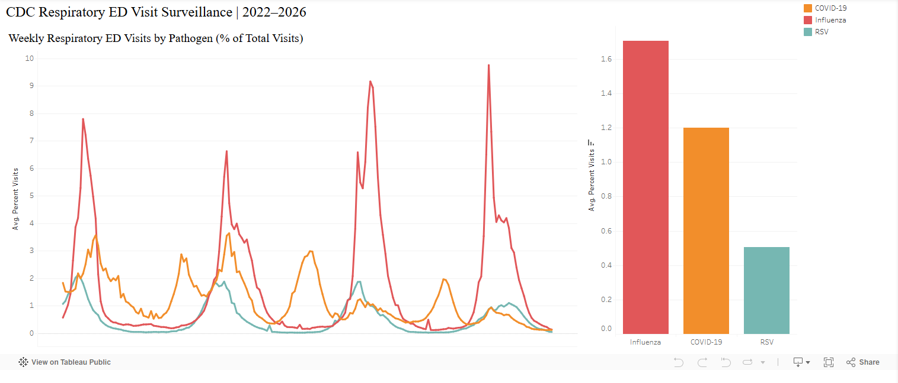

# CDC Respiratory ED Visit Surveillance | 2022–2026
### Healthcare Cloud Analytics Pipeline: Python → AWS S3 → Alteryx → Snowflake → Tableau Public

---

## Project Overview

This project builds a complete, multi-tool cloud analytics pipeline using real, publicly published CDC emergency department respiratory surveillance data. The goal is to track weekly respiratory illness burden (COVID-19, Influenza, and RSV) across the United States from 2022 through 2026, surfacing seasonal trends and pathogen-level comparisons through a published Tableau Public dashboard.

Unlike purely theoretical portfolio projects, every tool in this pipeline is either a production tool used in my day-to-day professional work (Snowflake, Alteryx) or a platform I deliberately pursued as a new technical skill (Tableau Public). The dataset is real, the pipeline is genuinely functional, and the architectural decisions reflect real-world data engineering practice — including honest documentation of limitations.

---

## Live Dashboard

**[CDC Respiratory ED Visit Surveillance 2022–2026 — Tableau Public](https://public.tableau.com/app/profile/rex.burdette4656/viz/CDCRespiratoryEDVisitSurveillance2022-2026/Dashboard1)**

---

## Dashboard Preview



---

## Data Source

**CDC National Syndromic Surveillance Program (NSSP)**
Emergency Department visits for respiratory illness, reported as percent of total ED visits by pathogen and demographic group.

- **Source:** data.cdc.gov (publicly available, no authentication required)
- **Dataset:** NSSP Emergency Department Visit Trajectories by State and Sub-State Region
- **Rows in this pipeline:** 11,700 (after filtering "Invalid" demographic values)
- **Pathogens covered:** COVID-19, Influenza, RSV
- **Date range:** August 2022 – June 2026 (weekly cadence)
- **Geography:** United States (national level)

---

## Pipeline Architecture

```
CDC NSSP API (data.cdc.gov)
        │
        ▼
Python (requests + pandas)
  → Pull full dataset via CSV API endpoint
  → Upload timestamped raw file to AWS S3
        │
        ▼
AWS S3 — rmb3000-cdc-respiratory-2026/raw/
  → Landing zone for raw CDC data
        │
        ▼
Alteryx One (Designer Cloud Workflow)
  → Connect to S3 via IAM credential connection
  → Filter: remove rows where demographics_values = "Invalid"
  → Output cleaned file to S3 /Cleaned/ folder
        │
        ▼
AWS S3 — rmb3000-cdc-respiratory-2026/Cleaned/
  → Staging zone for Snowflake ingestion
        │
        ▼
Snowflake
  → External S3 Stage (CDC_S3_STAGE)
  → COPY INTO command loads cleaned CSV
  → Target: CDC_RESPIRATORY_DB.RAW.RESPIRATORY_CLEANED
  → 11,700 rows loaded
        │
        ▼
Tableau Public
  → CSV export from Snowflake query results
  → Imported into Tableau Public Desktop
  → Two-view dashboard: weekly trend lines + average by pathogen bar chart
  → Published to Tableau Public (live, interactive)
```

---

## Tools & Technologies

| Tool | Role | Notes |
|------|------|-------|
| Python (pandas, boto3, requests) | Data ingestion script | Pulls CDC API, uploads to S3 |
| AWS S3 | Cloud storage / staging | Raw and Cleaned prefixes |
| AWS IAM | Credential management | Least-privilege IAM user (S3FullAccess) |
| Alteryx One | Cloud-based ETL transformation | Designer Cloud workflow, S3 connector |
| Snowflake | Cloud data warehouse | Trial account, external S3 stage, COPY INTO |
| Tableau Public | Data visualization | Desktop + Public publishing |
| SQL | Snowflake setup and data export | DDL, file format, stage, COPY INTO |

---

## Snowflake Schema

```sql
DATABASE:  CDC_RESPIRATORY_DB
SCHEMA:    RAW
TABLE:     RESPIRATORY_CLEANED

COLUMNS:
  WEEK_END               DATE
  GEOGRAPHY              VARCHAR(100)
  PATHOGEN               VARCHAR(50)
  DEMOGRAPHICS_TYPE      VARCHAR(50)
  DEMOGRAPHICS_VALUES    VARCHAR(50)
  PERCENT_VISITS         FLOAT
```

---

## Dashboard Views

### 1. Weekly Respiratory ED Visits by Pathogen (% of Total Visits)
Line chart showing weekly percent of ED visits attributed to COVID-19, Influenza, and RSV from August 2022 through June 2026. Seasonal winter surges are clearly visible, with Influenza showing the highest peak values in most seasons.

### 2. Average Percent of ED Visits by Pathogen
Pareto-sorted bar chart showing average weekly ED visit percentage across the full measurement period for each pathogen. Influenza leads at 1.7%, followed by COVID-19 at 1.2%, and RSV at 0.5%.

---

## Honest Limitations

**Tableau Public live connection:** Tableau Public does not support live Snowflake connections. The dashboard uses a CSV snapshot exported from Snowflake rather than a direct database connection. This is standard practice for Tableau Public deployments and is documented here rather than obscured.

**AWS Kinesis:** This pipeline was originally designed to include a real-time streaming layer via AWS Kinesis Data Streams. A persistent account verification issue with my AWS trial account prevented Kinesis from being provisioned despite an open support case. The pipeline was redesigned to use S3 batch ingestion — a more common and arguably more appropriate pattern for this weekly-refresh use case anyway.

**Alteryx One trial tier:** The trial tier does not include a native Snowflake output connector. S3 was used as an intermediate staging layer between Alteryx and Snowflake — which is a standard, legitimate real-world architecture pattern, not a workaround.

**"Combined" pathogen category:** The CDC dataset includes a "Combined" aggregate pathogen value in addition to the individual pathogen rows. This was filtered out in the Tableau dashboard (not at the Alteryx layer) to isolate the three individual pathogen trend lines. The Snowflake table retains all rows including "Combined."

---

## Key Findings

- **Influenza shows the highest seasonal peaks** across most winter seasons in this dataset, reaching nearly 10% of ED visits at peak in late 2025
- **COVID-19 dominated early in the dataset** (late 2022) but has trended downward relative to Influenza over the measurement period
- **RSV follows a consistent seasonal pattern** but at lower overall burden than COVID-19 or Influenza
- **Clear annual seasonality** is visible across all three pathogens, with peaks in November–February and troughs in summer months

---

## Author

**Rex M. Burdette, MBA**
Senior Data & Process Analytics Lead | Lean Six Sigma Master Black Belt
rex@rexsixsigma.com | [linkedin.com/in/rexburdette](https://linkedin.com/in/rexburdette) | [github.com/rmb3000/Portfolio](https://github.com/rmb3000/Portfolio)

