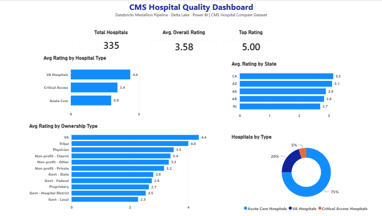
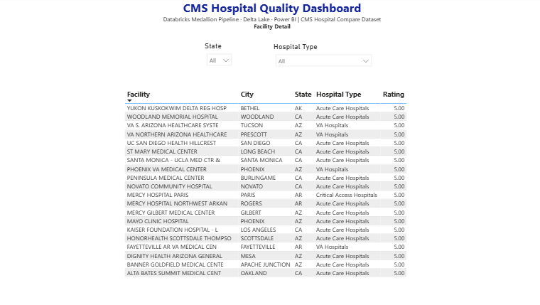

# CMS Hospital Quality Analytics — Databricks Lakehouse


A complete end-to-end healthcare analytics pipeline built on **Databricks** using **Medallion architecture** — from live CMS API ingestion through Bronze, Silver, and Gold Delta Lake layers to a 2-page interactive Power BI Desktop dashboard surfacing hospital quality analytics across 335 rated U.S. facilities.

---

## Dashboard Preview


---

## 📋 Project Overview

**CMS Hospital General Information** is a publicly available dataset published by the Centers for Medicare & Medicaid Services (CMS) through the Provider Data Catalog. It contains overall quality star ratings, hospital type, ownership category, and geographic data for thousands of U.S. hospitals.

This project demonstrates a production-grade Medallion Lakehouse pipeline — ingesting live CMS data via REST API, transforming through Bronze, Silver, and Gold Delta layers on Databricks, and delivering an interactive executive dashboard in Power BI Desktop with a live Databricks connection.

---

## 🏗️ Architecture

```
CMS Provider Data API (xubh-q36u)
          │
          ▼
┌─────────────────────┐
│       BRONZE        │
│   Delta Lake Table  │  Raw API ingestion — full fidelity, no transformations
│  bronze_hospital_   │  REST JSON → PySpark DataFrame → Delta write
│     general         │
└─────────────────────┘
          │
          ▼
┌─────────────────────┐
│       SILVER        │
│   Delta Lake Table  │  Column selection and rename (16 → 16 typed columns)
│  silver_hospital_   │  Data type casting, null handling, quality flags
│     quality         │  Hospital type standardization (VA normalization)
└─────────────────────┘
          │
          ▼
┌─────────────────────┐
│        GOLD         │
│  Four Delta Tables  │  Aggregated, analytics-ready
│                     │  gold_hospital_by_state
│                     │  gold_hospital_by_type
│                     │  gold_hospital_by_ownership
│                     │  gold_top_rated_hospitals
└─────────────────────┘
          │
          ▼
┌─────────────────────┐
│      Power BI       │  Live Databricks connection
│  Desktop Dashboard  │  2-page interactive report
└─────────────────────┘
```

---

## 📊 Dashboard

### Page 1 — Quality Overview


**Key Visuals:**
- **KPI Cards** — Total Hospitals (335), Avg. Overall Rating (3.58), Top Rating (5.00)
- **Avg Rating by Hospital Type** — horizontal bar chart (VA, Critical Access, Acute Care)
- **Avg Rating by State** — Top 5 states by average quality rating
- **Avg Rating by Ownership Type** — 11 ownership categories ranked by rating
- **Hospitals by Type** — donut chart showing distribution across facility types

### Page 2 — Facility Detail


**Key Visuals:**
- **State Slicer** — dropdown filter for all 50 states
- **Hospital Type Slicer** — dropdown filter by facility type
- **Facility Table** — filterable list of top-rated hospitals with city, state, type, and rating

---

## 📈 Key Findings

| Hospital Type | Avg Rating | Facility Count |
|---|---|---|
| VA Hospitals | 4.4 | 11 |
| Critical Access Hospitals | 3.4 | 12 |
| Acute Care Hospitals | 3.0 | 312 |

| State | Avg Rating | Hospital Count |
|---|---|---|
| CA | 3.2 | 167 |
| AZ | 3.1 | 55 |
| AK | 2.9 | 10 |
| AR | 2.8 | 44 |
| AL | 2.7 | 59 |

**Key insight:** VA Hospitals significantly outperform all other facility types with a 4.4 average rating — nearly 1.5 points above the overall average of 3.58. Acute Care Hospitals, which represent 75% of all rated facilities, score below the overall average at 3.0.

---

## 🗄️ Gold Layer Tables

| Table | Description | Key Columns |
|---|---|---|
| `gold_hospital_by_state` | Avg rating and counts by state | state, avg_rating, hospital_count, rated_count |
| `gold_hospital_by_type` | Avg rating by hospital type | hospital_type, avg_rating, hospital_count |
| `gold_hospital_by_ownership` | Avg rating by ownership category | ownership, avg_rating, hospital_count |
| `gold_top_rated_hospitals` | Facility-level detail, top-rated facilities | facility_name, city, state, hospital_type, overall_rating |

---

## 🔍 Sample Python — Silver Transformation

```python
# Read Bronze Delta table
df_bronze = spark.table("bronze_hospital_general").toPandas()

# Select and rename key columns
df_silver = df_bronze[silver_cols].copy()

# Standardize hospital_type values
df_silver['hospital_type'] = df_silver['hospital_type'].str.replace(
    'Acute Care - Veterans Administration', 'VA Hospitals', regex=False
)

# Fix data types
df_silver['overall_rating'] = pd.to_numeric(df_silver['overall_rating'], errors='coerce')

# Data quality flag
df_silver['data_quality_flag'] = df_silver['overall_rating'].isna()
```

---

## 🔍 Sample Python — Gold Aggregation

```python
# Aggregate by state
gold_by_state = (
    df_silver[df_silver['overall_rating'].notna()]
    .groupby('state')
    .agg(
        avg_rating=('overall_rating', 'mean'),
        hospital_count=('facility_id', 'count'),
        rated_count=('overall_rating', 'count')
    )
    .reset_index()
)

# Write to Delta
spark.createDataFrame(gold_by_state).write \
    .format("delta").mode("overwrite") \
    .saveAsTable("gold_hospital_by_state")
```

---

## 🛠️ Tech Stack

| Layer | Technology |
|---|---|
| Compute | Databricks (Serverless) |
| Storage Format | Delta Lake |
| Ingestion | Python (Requests, REST API) |
| Transformation | Python (PySpark + Pandas) |
| Orchestration | Databricks Notebook |
| Visualization | Power BI Desktop |
| Connection | Live Databricks Connection |
| Data Source | CMS Provider Data API |

---

## 📁 Repository Structure

```
CMS_HospitalQuality_Lakehouse/
│
├── notebooks/
│   ├── CMS_Bronze_Ingestion.ipynb
│   ├── CMS_Silver_Transformation.ipynb
│   └── CMS_Gold_Aggregation.ipynb
│
├── screenshots/
│   ├── dashboard_pg1.png
│   └── dashboard_pg2.png
│
└── README.md
```

---

## 🏥 Data Source

| Field | Detail |
|---|---|
| Dataset | CMS Hospital General Information |
| Publisher | Centers for Medicare & Medicaid Services |
| Dataset ID | xubh-q36u |
| URL | https://data.cms.gov/provider-data/dataset/xubh-q36u |
| Access | Public REST API — no authentication required |
| Update Frequency | Quarterly |

---

## 👤 About

Built by **Rex M. Burdette, MBA** — Senior Data Analytics Leader and Lean Six Sigma Master Black Belt with 20+ years in healthcare and manufacturing analytics.

- 🔗 [LinkedIn](https://linkedin.com/in/rexburdette)
- 📧 rex.burdette@gmail.com
- 🐙 [GitHub](https://github.com/rmb3000)

---

*This project uses publicly available CMS data. No private patient data was used.*
