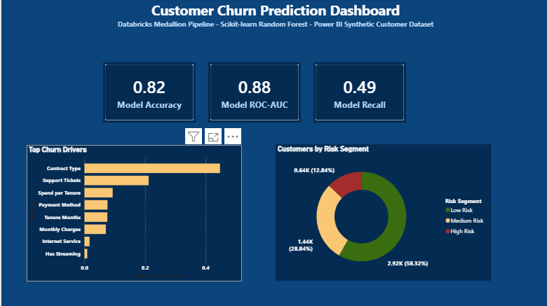
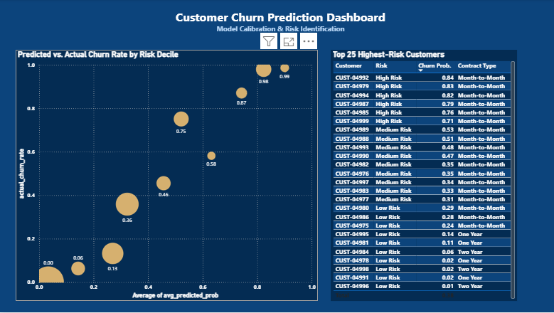

# Customer Churn Prediction Lakehouse
## Databricks Medallion Architecture | scikit-learn Random Forest | Power BI Risk Dashboard


A complete end-to-end predictive analytics pipeline built on **Databricks** using **Medallion architecture** — from synthetic customer generation through Bronze, Silver, and Gold Delta Lake layers, into a **scikit-learn Random Forest classifier**, and out to a 2-page interactive Power BI Desktop dashboard surfacing churn risk segmentation, model calibration, and the highest-priority retention targets.

---

## Dashboard Preview


---

## 📋 Project Overview

Customer churn prediction is one of the highest-ROI applications of predictive analytics in subscription and recurring-revenue businesses — every percentage point of churn reduction compounds directly into retained recurring revenue, while misallocated retention spend (targeting customers who were never going to leave) erodes margin just as fast.

This project simulates a telecom-style subscription customer base — 5,000 customers across contract type, payment method, internet service, and support interaction history — demonstrating a production-style ML pipeline: Bronze/Silver/Gold Delta layers on Databricks, feature engineering and categorical encoding, a trained Random Forest classifier with full model evaluation, and a dark-themed Power BI dashboard built for a retention/customer-success audience to act on, not just admire.

---

## 🏗️ Architecture

```
Synthetic Customer Generation (NumPy)
          │
          ▼
┌─────────────────────┐
│       BRONZE        │  Raw synthetic customer generation
│   Delta Lake Table  │  5,000 customers, 9 raw attributes
│  bronze_customer_   │  tenure, contract, charges, tickets,
│       churn          │  payment method, internet, streaming, churned
└─────────────────────┘
          │
          ▼
┌─────────────────────┐
│       SILVER        │  Feature engineering & encoding
│   Delta Lake Table  │  Categorical → numeric encoding
│  silver_customer_   │  spend_per_tenure engagement proxy
│       churn          │  data_quality_flag for nulls
└─────────────────────┘
          │
          ▼
┌─────────────────────┐
│        GOLD         │  Model training + analytics-ready tables
│  scikit-learn RF +   │  gold_churn_predictions (scored customers)
│   4 Delta Tables     │  gold_feature_importance
│                      │  gold_model_metrics
│                      │  gold_model_calibration (predicted vs actual)
└─────────────────────┘
          │
          ▼
┌─────────────────────┐
│      Power BI       │  Live Databricks connection
│  Desktop Dashboard  │  2-page interactive report
└─────────────────────┘
```

---

## 🤖 Model

**Algorithm:** Random Forest Classifier (scikit-learn)
**Configuration:** 100 estimators, max depth 8, stratified 80/20 train/test split, random_state=42

| Metric | Score |
|---|---|
| Accuracy | 0.823 |
| Precision | 0.815 |
| Recall | 0.493 |
| ROC-AUC | 0.878 |

**Note on recall:** the model is intentionally tuned toward precision over recall — when a churn flag fires, it's right 81.5% of the time, which matters for a retention team with limited outreach capacity. The trade-off is that it misses roughly half of actual churners (recall 0.493), a known limitation discussed further in Key Findings below.

---

## 📊 Dashboard

### Page 1 — Model Performance & Risk Segmentation


**Key Visuals:**
- **KPI Cards** — Model Accuracy (0.82), Model ROC-AUC (0.88), Model Recall (0.49)
- **Top Churn Drivers** — horizontal bar chart of Random Forest feature importance across all 8 model features
- **Customers by Risk Segment** — donut chart: Low Risk (2.92K / 58.3%), Medium Risk (1.44K / 28.8%), High Risk (0.64K / 12.8%)

### Page 2 — Model Calibration & Risk Identification


**Key Visuals:**
- **Predicted vs. Actual Churn Rate by Risk Decile** — bubble chart validating model calibration across 10 probability buckets, bubble size = customer count
- **Top 25 Highest-Risk Customers** — sortable table with Customer ID, Risk Segment, Churn Probability, and Contract Type — built as a direct, actionable retention outreach list

---

## 📈 Key Findings

| Driver | Feature Importance | Business Read |
|---|---|---|
| Contract Type | 44.7% | Month-to-month customers churn at far higher rates than 1- or 2-year contracts — by a wide margin the dominant signal |
| Support Tickets | 21.2% | Customers with 3+ tickets are flagged as high-risk; service friction is the #2 churn driver |
| Spend per Tenure | 9.3% | High spend relative to tenure (newer, higher-paying customers) signals engagement risk |
| Payment Method | 7.6% | Electronic check customers churn more than autopay/bank transfer customers |
| Tenure Months | 7.5% | Shorter-tenure customers are measurably more likely to leave |

**Key insight:** Contract type alone accounts for nearly half of the model's predictive power — a customer's commitment structure matters more than their bill amount, support history, or service type combined. This points retention strategy directly at contract conversion (incentivizing month-to-month customers onto annual terms) as the highest-leverage lever, ahead of service quality fixes.

**Model calibration:** the Page 2 decile chart shows predicted probabilities tracking closely with actual churn rates across most buckets — the model is well-calibrated, not just well-separated, meaning predicted probabilities can be trusted as genuine likelihoods for prioritizing outreach, not just relative rankings.

**Recall trade-off:** at 49.3% recall, roughly half of customers who will churn are not flagged as high-risk. For a production deployment, this would be addressed by adjusting the classification threshold or rebalancing class weights — a deliberate scope boundary here to keep precision high for a resource-constrained retention team.

---

## 🗄️ Gold Layer Tables

| Table | Description | Key Columns |
|---|---|---|
| `gold_churn_predictions` | Full scored customer base | customer_id, tenure_months, contract_type, monthly_charges, support_tickets, payment_method, churned, churn_probability, churn_predicted, risk_segment |
| `gold_feature_importance` | Random Forest feature ranking | feature, importance |
| `gold_model_metrics` | Model evaluation results | metric, value |
| `gold_model_calibration` | Predicted vs. actual by decile | probability_bucket, avg_predicted_prob, actual_churn_rate, customer_count |

---

## 🔍 Sample Python — Feature Engineering (Silver)

```python
# Encode categorical variables
le_contract = LabelEncoder()
df_silver['contract_type_encoded'] = le_contract.fit_transform(df_silver['contract_type'])

# Feature: average monthly spend per tenure month (engagement proxy)
df_silver['spend_per_tenure'] = df_silver['monthly_charges'] / df_silver['tenure_months']

# Data quality flag
df_silver['data_quality_flag'] = df_silver[['tenure_months', 'monthly_charges']].isna().any(axis=1)
```

---

## 🔍 Sample Python — Model Training (Gold)

```python
feature_cols = ['tenure_months', 'monthly_charges', 'support_tickets',
                 'contract_type_encoded', 'payment_method_encoded',
                 'internet_service_encoded', 'has_streaming_encoded', 'spend_per_tenure']

X_train, X_test, y_train, y_test = train_test_split(
    X, y, test_size=0.2, random_state=42, stratify=y
)

model = RandomForestClassifier(n_estimators=100, max_depth=8, random_state=42)
model.fit(X_train, y_train)

# Risk segmentation for dashboard
df_gold_source['risk_segment'] = pd.cut(
    df_gold_source['churn_probability'],
    bins=[0, 0.3, 0.6, 1.0],
    labels=['Low Risk', 'Medium Risk', 'High Risk']
)
```

---

## 🛠️ Tech Stack

| Layer | Technology |
|---|---|
| Compute | Databricks (Serverless) |
| Storage Format | Delta Lake |
| Data Generation | Python (NumPy synthetic generation) |
| Feature Engineering | Python (Pandas, scikit-learn LabelEncoder) |
| Model | scikit-learn (RandomForestClassifier) |
| Model Evaluation | scikit-learn (accuracy, precision, recall, ROC-AUC) |
| Orchestration | Databricks Notebooks (3 — Bronze, Silver, Gold) |
| Visualization | Power BI Desktop (Live Databricks Connection) |
| Data Source | Synthetic — generated in Bronze notebook |

---

## 📁 Repository Structure

```
CustomerChurn_Prediction_Lakehouse/
│
├── Churn_Bronze_Generation.ipynb
├── Churn_Silver_FeatureEngineering.ipynb
├── Churn__Gold_ModelTraining.ipynb
├── Churn_Predictive_Model.pbix
│
├── screenshots/
│   ├── dashboard_pg1.png
│   └── dashboard_pg2.png
│
└── README.md
```

---

## 🗂️ Data Source

| Field | Detail |
|---|---|
| Dataset | Synthetic Customer Churn Data |
| Generation Method | NumPy — seeded (random_state=42) for reproducibility |
| Total Records | 5,000 customers |
| Churn Rate | 28.6% |
| Attributes | Tenure, contract type, monthly charges, support tickets, payment method, internet service, streaming add-on |
| Churn Logic | Weighted composite score: month-to-month contract, 3+ support tickets, short tenure (<6 months), and electronic check payment all increase churn probability, plus random noise |

---

## 👤 About

Built by **Rex M. Burdette, MBA** — Senior Data Analytics Leader and Lean Six Sigma Master Black Belt with 20+ years in healthcare and manufacturing analytics.

- 🔗 [LinkedIn](https://linkedin.com/in/rexburdette)
- 📧 rex.burdette@gmail.com
- 🐙 [GitHub](https://github.com/rmb3000)

---

*This project uses entirely synthetic, randomly generated customer data. No real customer or proprietary data was used.*

