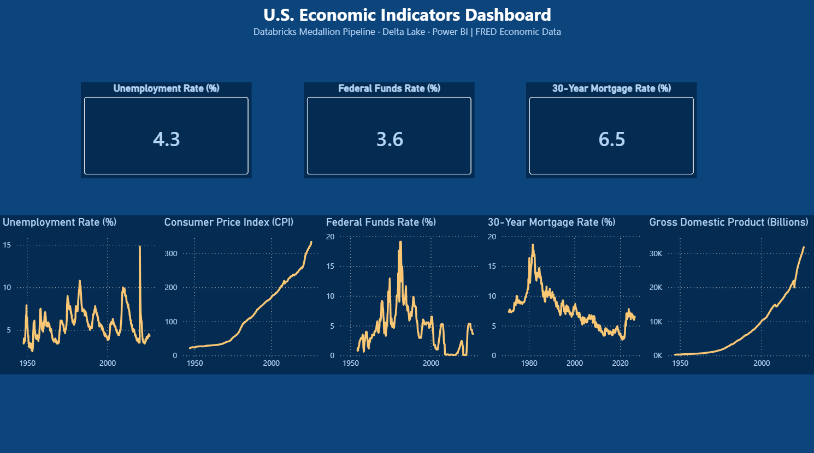
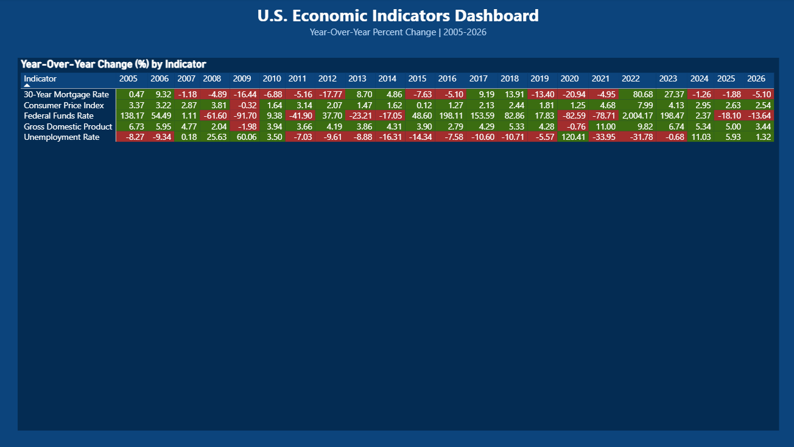

# FRED Economic Indicators Lakehouse
## Databricks Medallion Architecture | Live FRED API Ingestion | Time-Series Analytics


A complete end-to-end economic analytics pipeline built on **Databricks** using **Medallion architecture** — from live FRED API ingestion through Bronze, Silver, and Gold Delta Lake layers to a 2-page interactive Power BI Desktop dashboard surfacing U.S. economic indicator trends and year-over-year change analysis from 1948 to present.

---

## Dashboard Preview


---

## 📋 Project Overview

**FRED (Federal Reserve Economic Data)** is the Federal Reserve Bank of St. Louis's public database of 800,000+ U.S. and global economic time series, maintained and updated continuously by the Federal Reserve. It is the reference standard for macroeconomic data used by economists, analysts, and financial institutions worldwide.

This project demonstrates a production-grade time-series analytics pipeline — ingesting five key economic indicators directly from the FRED REST API, transforming through Bronze, Silver, and Gold Delta layers on Databricks, building a proper **Dim Date table** for time intelligence joins, and delivering a dark-themed interactive Power BI Desktop dashboard with trend line analysis and year-over-year conditional heat map.

---

## 🏗️ Architecture

```
FRED REST API (api.stlouisfed.org)
          │
          ├── UNRATE     — Unemployment Rate (monthly, 1948–present)
          ├── CPIAUCSL   — Consumer Price Index (monthly, 1947–present)
          ├── FEDFUNDS   — Federal Funds Rate (monthly, 1954–present)
          ├── MORTGAGE30US — 30-Year Mortgage Rate (weekly, 1971–present)
          └── GDP        — Gross Domestic Product (quarterly, 1947–present)
          │
          ▼
┌─────────────────────┐
│       BRONZE        │  Raw API ingestion — full fidelity, no transformations
│   Delta Lake Table  │  5,960 records across 5 series
│  bronze_fred_       │  date, series_id, value (all as strings)
│     economic        │
└─────────────────────┘
          │
          ▼
┌─────────────────────┐
│       SILVER        │  Cleaned, typed, enriched
│   Delta Lake Table  │  Date → datetime, value → numeric
│  silver_fred_       │  series_name mapping added
│     economic        │  data_quality_flag for nulls
└─────────────────────┘
          │
          ▼
┌─────────────────────┐
│        GOLD         │  Analytics-ready tables
│   Four Delta Tables │  gold_dim_date (29,389 daily rows)
│                     │  gold_fact_economic
│                     │  gold_latest_values
│                     │  gold_yearly_yoy_change
└─────────────────────┘
          │
          ▼
┌─────────────────────┐
│      Power BI       │  Live Databricks connection
│  Desktop Dashboard  │  2-page interactive report
└─────────────────────┘
```

---

## 📊 Dashboard

### Page 1 — Economic Overview


**Key Visuals:**
- **KPI Cards** — Current Unemployment Rate (4.3%), Federal Funds Rate (3.6%), 30-Year Mortgage Rate (6.5%)
- **Unemployment Rate (%)** — line chart, 1948–2026, showing all recession cycles and 2020 COVID spike
- **Consumer Price Index (CPI)** — line chart showing inflation trend from 1947 baseline to present
- **Federal Funds Rate (%)** — line chart showing the dramatic 1980s Volcker rate hikes and 2022–2023 hiking cycle
- **30-Year Mortgage Rate (%)** — line chart showing the historic decline from 18% in 1981 to recent lows and rebound
- **Gross Domestic Product (Billions)** — line chart showing U.S. economic growth from 1947 to present

### Page 2 — Year-Over-Year Trends


**Key Visuals:**
- **Conditional Heat Map Matrix** — Year-over-year percent change for all five indicators, 2005–2026
- Green cells = positive YoY change, Red cells = negative YoY change
- Immediately surfaces major economic events: 2009 financial crisis (red), 2021 recovery (green), 2022–2023 rate hikes

---

## 📈 Key Findings

| Indicator | Current Value | Notable Event |
|---|---|---|
| Unemployment Rate | 4.3% | 2020 COVID spike to 14.7% — visible in both trend and YoY matrix |
| Federal Funds Rate | 3.6% | 2021 YoY change of +2,004% — Fed hiking from near-zero |
| 30-Year Mortgage Rate | 6.5% | Historic low of ~2.7% in 2021, nearly tripled by 2023 |
| Consumer Price Index | 333.98 | Steady long-term inflation trend since 1947 baseline |
| Gross Domestic Product | $31,819B | Exponential growth with visible 2020 contraction and recovery |

**Key insight:** The year-over-year matrix on Page 2 surfaces the entire macroeconomic story of 2005–2026 in a single visual — the 2008–2009 financial crisis, the COVID shock, and the subsequent rate hiking cycle are all immediately visible without any annotation required.

---

## 🗄️ Gold Layer Tables

| Table | Description | Key Columns |
|---|---|---|
| `gold_dim_date` | Daily date dimension, 1946–2026 | date, year, month_number, month_name, quarter, year_month, day_of_week |
| `gold_fact_economic` | Long-format fact table, all five series | date, series_id, series_name, value, year |
| `gold_latest_values` | Most recent observation per series | date, series_id, series_name, value |
| `gold_yearly_yoy_change` | Annual average with YoY % change | series_id, series_name, year, value, prior_year_value, yoy_change_pct |

---

## 🔍 Sample Python — Silver Transformation

```python
# Read Bronze Delta table
df_silver = spark.table("bronze_fred_economic").toPandas()

# Fix data types
df_silver['date'] = pd.to_datetime(df_silver['date'])
df_silver['value'] = pd.to_numeric(df_silver['value'], errors='coerce')

# Add human-readable series names
series_names = {
    "UNRATE": "Unemployment Rate",
    "CPIAUCSL": "Consumer Price Index",
    "FEDFUNDS": "Federal Funds Rate",
    "MORTGAGE30US": "30-Year Mortgage Rate",
    "GDP": "Gross Domestic Product"
}
df_silver['series_name'] = df_silver['series_id'].map(series_names)

# Data quality flag
df_silver['data_quality_flag'] = df_silver['value'].isna()
```

---

## 🔍 Sample Python — Dim Date Build

```python
# Build Dim Date table spanning the full range of data
min_date = df_gold_source['date'].min()
max_date = df_gold_source['date'].max()

dim_date = pd.DataFrame({'date': pd.date_range(start=min_date, end=max_date, freq='D')})
dim_date['year'] = dim_date['date'].dt.year
dim_date['month_number'] = dim_date['date'].dt.month
dim_date['month_name'] = dim_date['date'].dt.strftime('%B')
dim_date['quarter'] = 'Q' + dim_date['date'].dt.quarter.astype(str)
dim_date['year_month'] = dim_date['date'].dt.strftime('%Y-%m')
dim_date['day_of_week'] = dim_date['date'].dt.strftime('%A')
```

---

## 🛠️ Tech Stack

| Layer | Technology |
|---|---|
| Compute | Databricks (Serverless) |
| Storage Format | Delta Lake |
| Ingestion | Python (Requests, REST API) |
| Transformation | Python (PySpark + Pandas) |
| Time Intelligence | Dim Date table (29,389 daily rows, 1946–2026) |
| Orchestration | Databricks Notebooks (3 — Bronze, Silver, Gold) |
| Visualization | Power BI Desktop (Live Databricks Connection) |
| Data Source | FRED API — Federal Reserve Bank of St. Louis |

---

## 📁 Repository Structure

```
FRED_EconomicIndicators_Lakehouse/
│
├── FRED_Bronze_Ingestion.ipynb
├── FRED_Silver_Transformation.ipynb
├── FRED_Gold_Aggregation.ipynb
├── FRED_EconomicIndicators.pbix
│
├── screenshots/
│   ├── dasboard_pg1.png
│   └── dasboard_pg2.png
│
└── README.md
```

---

## 🏦 Data Source

| Field | Detail |
|---|---|
| Dataset | FRED Economic Data |
| Publisher | Federal Reserve Bank of St. Louis |
| Series | UNRATE, CPIAUCSL, FEDFUNDS, MORTGAGE30US, GDP |
| Total Records | 5,960 observations across 5 series |
| Date Range | 1946–2026 (varies by series) |
| Access | Public REST API — free API key required |
| URL | https://fred.stlouisfed.org |

---

## 👤 About

Built by **Rex M. Burdette, MBA** — Senior Data Analytics Leader and Lean Six Sigma Master Black Belt with 20+ years in healthcare and manufacturing analytics.

- 🔗 [LinkedIn](https://linkedin.com/in/rexburdette)
- 📧 rex.burdette@gmail.com
- 🐙 [GitHub](https://github.com/rmb3000)

---

*This project uses publicly available Federal Reserve economic data. No private or proprietary data was used.*

